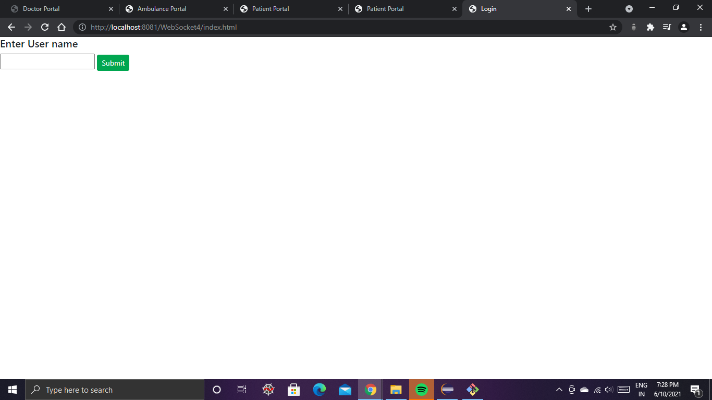
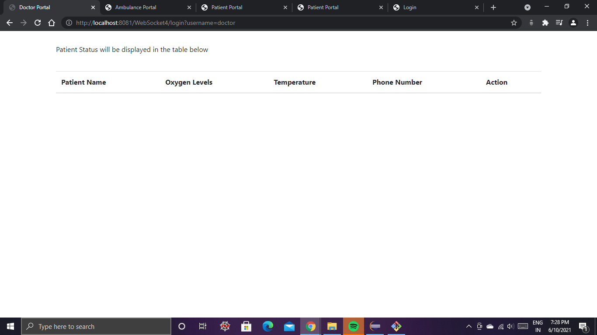
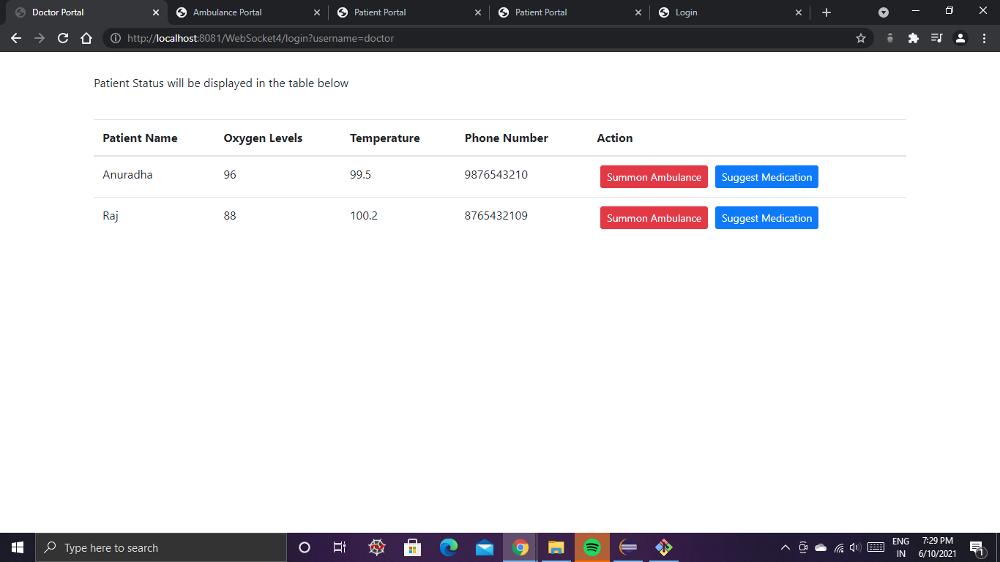
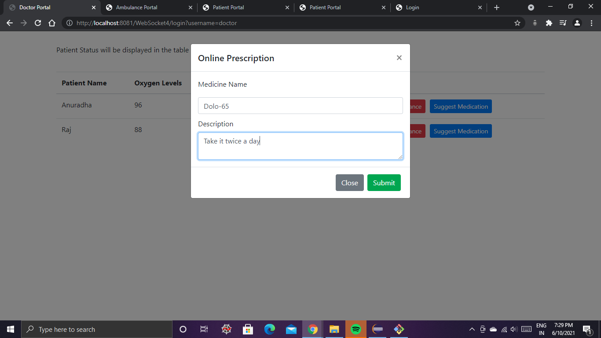
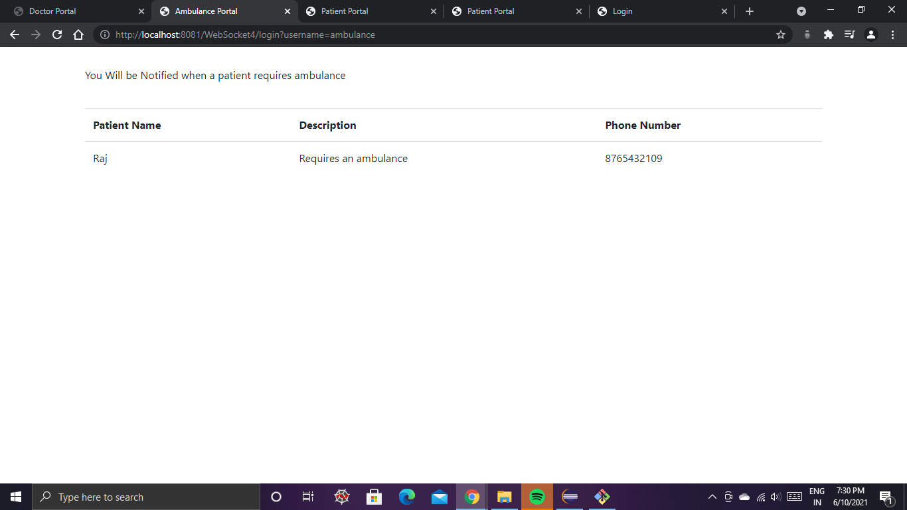
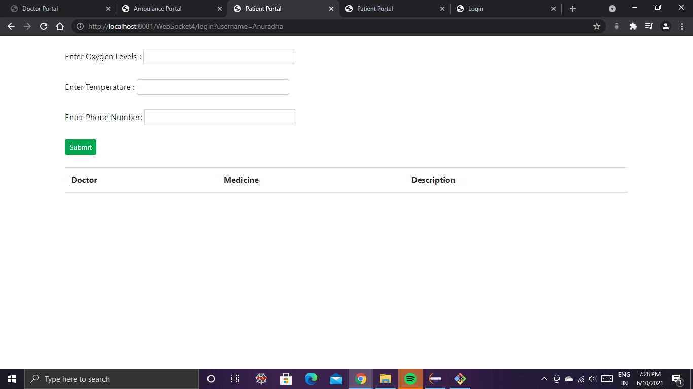
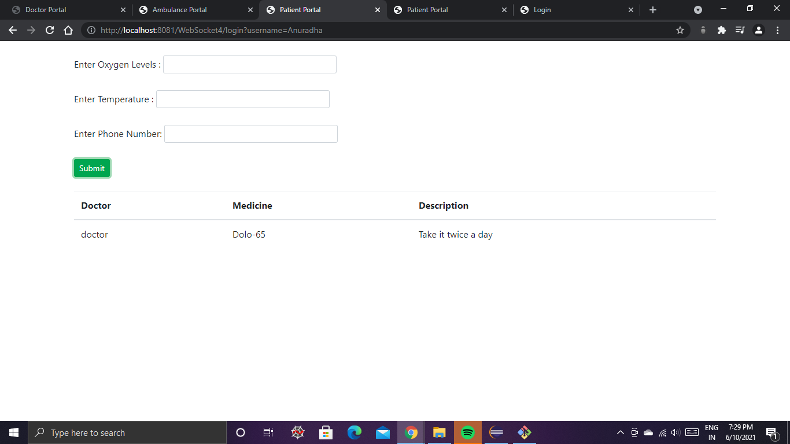
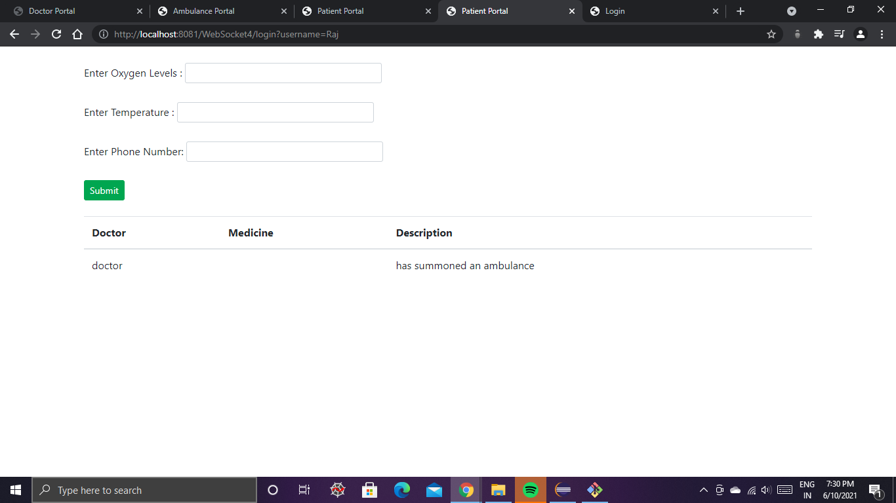

# Web-Sockets-with-Servlets
In a Web Socket application, the server publishes a Web Socket endpoint, and the client uses the endpoint's URI to connect to the server. The Web Socket protocol is symmetrical after the connection has been established; the client and the server can send messages to each other at any time while the connection is open, and they can close the connection at any time. Clients usually connect only to one server, and servers accept connections from multiple clients.

The Web Socket protocol has two parts: handshake and data transfer. The client initiates the handshake by sending a request to a Web Socket endpoint using its URI.

## Problem Statement

As the number of Covid-19 cases continue to raise in India, with limited number of covid-19 beds available, we need to effectively use the available beds.
Also the Asymptomatic patients and the patients with minimal symptoms are not required to be treated in hospitals. These patients can be in home isolation.
The patients in home isolation needs to be monitored time to time. If the temperature, Oxygen levels not in line with the recommendable range, the application 
should send notifications to the doctor portal immediately. On receiving the patient data, doctor may either prescribe medicine or refer the patient to admit to the hospital.
If the doctor refers the patient to admit to the hospital, application should send notifications to ambulance service portal and to the patient.

1. <b>Patient Module</b>: Should be able enter patient data (Temperature, Oxygen levels) and submit.
This page should be able to display medical prescription (medicine name, description like what time the patient need to take that medicine and how many times a day etc). 
Also if the doctor advices the patient to admit to the hospital, this page should display the alert message to the corresponding patient.

2. <b>Doctor Module</b>: The page should display the status of patients (Patient name/id, Patient Readings) in a table, one row for each patient. 
The last two columns in the row should have two buttons, one to suggest medication and the other to suggest the patient to admit to the hospital.
If the doctor clicks on the suggest medication button, a dialog box should appear with two input fields, where doctor can enter medicine name & description and a button, 
to send the data to the patient. If the doctor clicks on the second button, the application should send notifications to ambulance service portal and to the patient. 
This portal should be ready before patient sends his data.

3. <b>Ambulance Service Module</b>: This page should be able to display the information of the patients who require ambulance service as suggested by the doctor. 
This portal should be ready before doctor makes any suggestions for patients to admit to hospital.

## Steps for implementation:

1. Create a login page.
2. Invoke the Servlet (Server side application) to process the login request. The Servlet should capture & store the user identity in the HttpSession object and forward the request to patient/doctor/ambulance service page, depending on the type of user.
3. Create Custom End Point Configurator and override modifyHandshake(), to Access the details of the initial HTTP request (ie to store user identity at Server End point configuration) for a Web Socket connection.
4. Create an Annotated Server End point class.
5. In Server End point class, override handleOpen() to retrieve user identity and store at user session as soon as the new socket connection created for that client from the end point.
6. In Server End point class, also add this user to the list of users, who currently had their connection opened with this end point. So that any user can send message to any other active users in the list.
7. In Server End point class, override handleMessage() method as, if the end point received message from patient module, send the received patient details to doctor module.
8. If the end point received message from doctor, if the action is medication then send the data (medicine,description) to patient module. If the action is suggestion for patient to admit to hospital, send alerts to both patient and ambulance service modules.
9. Create patient page to connect to the server end point, send patient data also to receive doctor's actions.
10. Create doctor page to connect to the server end point, receive patient's status and to take action.
11. Create ambulance service page to connect to the server end point, receive ambulance service requests and display the details of those patients.

## Preview
* Login
  
* Doctor
  
  Doctor Page after patient information
  
  Medication
  

* Ambulance
   
   
* Patient
  
  Patient 1
  
  Patient 2
  
